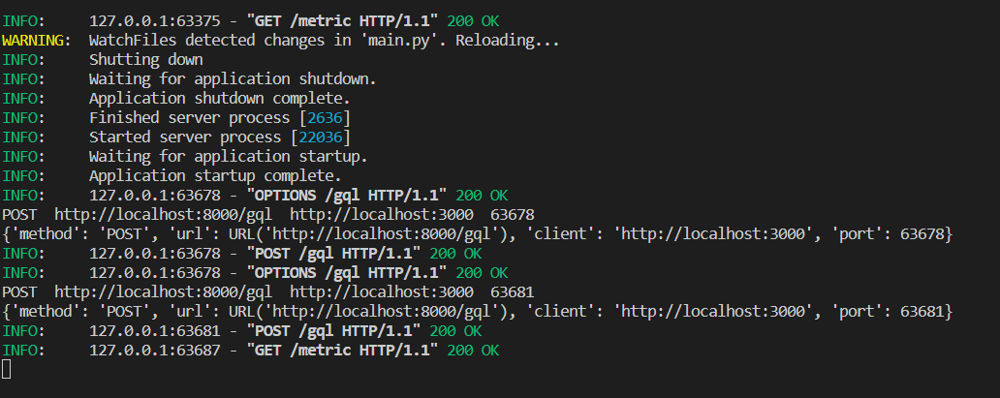
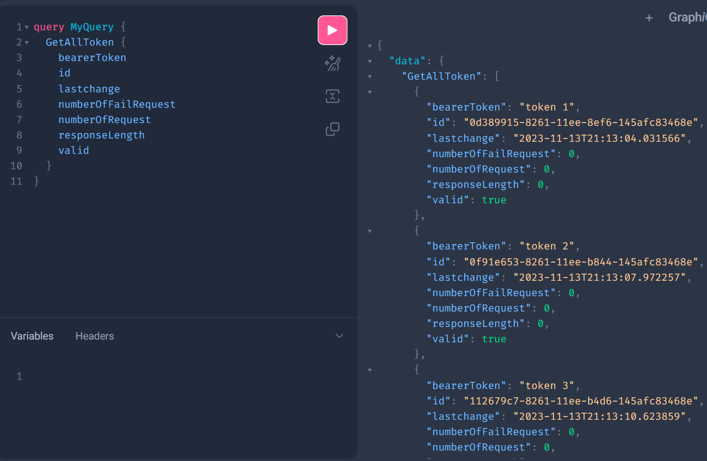

# SYSLOG
Monitor GQL endpoint requests using FastAPI and Prometheus to scrape metrics and reverse proxy configurated by NGINX
Captain's log:
 
-10/4/2023 : Created and public the GitHub respository for the project.
 
-10/10/2023: Development plan and milestone for the project created
            Created a database ( database first approach ) for testing
 
-10/13/2023: Successfully connect front end, monitor and database. All testing will be perform using UG_Database a UserGroup front end page
 
-10/16/2023: Project Day 1. 

  11/7/2023: Adding a syslog container that transport log to port 514
 11/13/2023: Finishing the database for containing bearer token 

  11/19/2023: Updating the functions with database
 11/26/2023: Functions for recording request made with token completed but still faulty. i.e When mutilple request with the token come at once it would mess up databasevs

  Project Day 2.

  1/12: Using isolation level and while loop to queue session into the database resolve the problem above
-> Next is to test this application on mutilple devices to test it's effectivenenss
  14/12: Simple frontend created to sending test request for monitoring
  10/1 Token life limit is added to control how long a JWT will be valid for
  Project Day 3:
     Only MONITORING UNAUTHORIZED REQUEST unfinished
  20/1 Adding users table to keep track of how many tokens a user has
  1/2 Violations is added to the database 

Violation is for database admin to record unauthorized request --> there is option to get all unauthorized request made by the user
  12-14/2 Finishing up code and adding comment
Generating documents and final touch up

